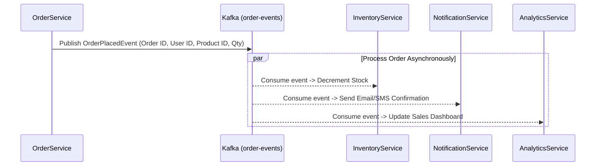

# 🚀 NexusCart - Advanced Architecture & Production Guide

This guide covers advanced enterprise software engineering concepts, design patterns, containerization, security, distributed caching, event-driven messaging, and observability for the NexusCart E-Commerce Microservices Platform.

---

## 📑 Table of Contents
1. [Event-Driven Architecture (Apache Kafka)](#1-event-driven-architecture-apache-kafka)
2. [Distributed Caching Layer (Redis)](#2-distributed-caching-layer-redis)
3. [Resilience & Circuit Breakers (Resilience4j)](#3-resilience--circuit-breakers-resilience4j)
4. [Distributed Security (Spring Security + JWT)](#4-distributed-security-spring-security--jwt)
5. [Distributed Tracing & Telemetry (Zipkin & Prometheus)](#5-distributed-tracing--telemetry-zipkin--prometheus)
6. [Containerization (Docker & Docker Compose)](#6-containerization-docker--docker-compose)
7. [Kubernetes (K8s) Deployment & Auto-Scaling](#7-kubernetes-k8s-deployment--auto-scaling)

---

## 1. Event-Driven Architecture (Apache Kafka)

Replacing synchronous REST API calls with asynchronous event streams decouples microservices and prevents thread starvation during traffic spikes.

### 1.1 Kafka Event Flow


### 1.2 Order Service - Kafka Producer Setup (`pom.xml`)
```xml
<dependency>
    <groupId>org.springframework.kafka</groupId>
    <artifactId>spring-kafka</artifactId>
</dependency>
```

### 1.3 Publishing `OrderPlacedEvent` in `OrderService.java`
```java
@Service
public class OrderService {
    @Autowired
    private KafkaTemplate<String, OrderPlacedEvent> kafkaTemplate;

    public String placeOrder(Order order) {
        // Save order to MongoDB
        orderRepository.save(order);

        // Publish event to Kafka topic "order-events"
        OrderPlacedEvent event = new OrderPlacedEvent(order.getId(), order.getUserId(), order.getProductId(), order.getQuantity());
        kafkaTemplate.send("order-events", order.getUserId(), event);

        return "Order Placed Successfully";
    }
}
```

---

## 2. Distributed Caching Layer (Redis)

Caching high-frequency database queries in Redis improves response times from ~100ms to <5ms.

### 2.1 Spring Boot Redis Integration
Add to `product/pom.xml`:
```xml
<dependency>
    <groupId>org.springframework.boot</groupId>
    <artifactId>spring-boot-starter-data-redis</artifactId>
</dependency>
<dependency>
    <groupId>org.springframework.boot</groupId>
    <artifactId>spring-boot-starter-cache</artifactId>
</dependency>
```

### 2.2 Redis Cache Annotations in `ProductService.java`
```java
@Service
@EnableCaching
public class ProductService {

    @Autowired
    private ProductRepository productRepository;

    // Cache products list in Redis key 'productsAll'
    @Cacheable(value = "productsAll")
    public List<Product> getAllProducts() {
        return productRepository.findAll();
    }

    // Evict Redis cache whenever a product is added or updated
    @CacheEvict(value = "productsAll", allEntries = true)
    public Product addProduct(Product product) {
        return productRepository.save(product);
    }
}
```

---

## 3. Resilience & Circuit Breakers (Resilience4j)

Circuit breakers prevent cascading system failure when a downstream microservice is lagging or offline.

### 3.1 API Gateway Circuit Breaker Configuration (`application.yml`)
```yaml
spring:
  cloud:
    gateway:
      routes:
        - id: product-service
          uri: lb://PRODUCT-SERVICE
          predicates:
            - Path=/products/**
          filters:
            - name: CircuitBreaker
              args:
                name: productServiceCircuitBreaker
                fallbackUri: forward:/fallback/products

resilience4j:
  circuitbreaker:
    instances:
      productServiceCircuitBreaker:
        slidingWindowSize: 10
        failureRateThreshold: 50
        waitDurationInOpenState: 10000ms
```

### 3.2 Gateway Fallback Controller
```java
@RestController
@RequestMapping("/fallback")
public class FallbackController {

    @GetMapping("/products")
    public ResponseEntity<List<Product>> productFallback() {
        // Return cached/fallback response when Product Service is unreachable
        return ResponseEntity.status(HttpStatus.SERVICE_UNAVAILABLE).body(Collections.emptyList());
    }
}
```

---

## 4. Distributed Security (Spring Security + JWT)

Secure all APIs across microservices using JSON Web Tokens (JWT) validated at the Gateway layer.

### 4.1 Gateway JWT Authentication Filter (`JwtAuthenticationFilter.java`)
```java
@Component
public class JwtAuthenticationFilter extends AbstractGatewayFilterFactory<JwtAuthenticationFilter.Config> {

    @Autowired
    private JwtUtil jwtUtil;

    @Override
    public GatewayFilter apply(Config config) {
        return (exchange, chain) -> {
            ServerHttpRequest request = exchange.getRequest();

            if (!request.getHeaders().containsKey(HttpHeaders.AUTHORIZATION)) {
                return onError(exchange, "Missing Authorization Header", HttpStatus.UNAUTHORIZED);
            }

            String authHeader = request.getHeaders().getOrEmpty(HttpHeaders.AUTHORIZATION).get(0);
            if (authHeader != null && authHeader.startsWith("Bearer ")) {
                String token = authHeader.substring(7);
                try {
                    jwtUtil.validateToken(token);
                } catch (Exception e) {
                    return onError(exchange, "Invalid/Expired Token", HttpStatus.UNAUTHORIZED);
                }
            }

            return chain.filter(exchange);
        };
    }
}
```

---

## 5. Distributed Tracing & Telemetry (Zipkin & Prometheus)

### 5.1 Trace Telemetry Setup (`pom.xml`)
```xml
<dependency>
    <groupId>io.micrometer</groupId>
    <artifactId>micrometer-tracing-bridge-brave</artifactId>
</dependency>
<dependency>
    <groupId>io.zipkin.reporter2</groupId>
    <artifactId>zipkin-reporter-brave</artifactId>
</dependency>
```

### 5.2 Application Telemetry Config
```yaml
management:
  tracing:
    sampling:
      probability: 1.0
  zipkin:
    tracing:
      endpoint: http://localhost:9411/api/v2/spans
```
Every log message automatically includes `[traceId, spanId]` for correlation across all 9 microservices.

---

## 6. Containerization (Docker & Docker Compose)

### 6.1 Microservice `Dockerfile`
```dockerfile
FROM openjdk:21-jdk-slim
VOLUME /tmp
ARG JAR_FILE=target/*.jar
COPY ${JAR_FILE} app.jar
ENTRYPOINT ["java","-jar","/app.jar"]
```

### 6.2 Master `docker-compose.yml`
```yaml
version: '3.8'

services:
  mongodb:
    image: mongo:latest
    ports:
      - "27018:27017"

  eureka-server:
    build: ./eureka-server
    ports:
      - "8761:8761"

  api-gateway:
    build: ./api-gateway
    ports:
      - "9002:9002"
    environment:
      - EUREKA_CLIENT_SERVICEURL_DEFAULTZONE=http://eureka-server:8761/eureka/

  auth-service:
    build: ./auth-service
    ports:
      - "9001:9001"
    environment:
      - SPRING_DATA_MONGODB_URI=mongodb://mongodb:27017/authdb

  product-service:
    build: ./product-service
    ports:
      - "9007:9007"
    environment:
      - SPRING_DATA_MONGODB_URI=mongodb://mongodb:27017/productdb
```

Run entire stack:
```bash
docker-compose up --build -d
```

---

## 7. Kubernetes (K8s) Deployment & Auto-Scaling

### 7.1 Product Service Deployment (`k8s/product-deployment.yaml`)
```yaml
apiVersion: apps/v1
kind: Deployment
metadata:
  name: product-service
spec:
  replicas: 3
  selector:
    matchLabels:
      app: product-service
  template:
    metadata:
      labels:
        app: product-service
    spec:
      containers:
      - name: product-service
        image: nexuscart/product-service:1.0.0
        ports:
        - containerPort: 9007
        resources:
          requests:
            cpu: "250m"
            memory: "512Mi"
          limits:
            cpu: "500m"
            memory: "1024Mi"
---
apiVersion: v1
kind: Service
metadata:
  name: product-service
spec:
  type: ClusterIP
  ports:
  - port: 9007
    targetPort: 9007
  selector:
    app: product-service
```

### 7.2 Horizontal Pod Autoscaler (`k8s/product-hpa.yaml`)
```yaml
apiVersion: autoscaling/v2
kind: HorizontalPodAutoscaler
metadata:
  name: product-service-hpa
spec:
  scaleTargetRef:
    apiVersion: apps/v1
    kind: Deployment
    name: product-service
  minReplicas: 2
  maxReplicas: 10
  metrics:
  - type: Resource
    resource:
      name: cpu
      target:
        type: Utilization
        averageUtilization: 70
```
