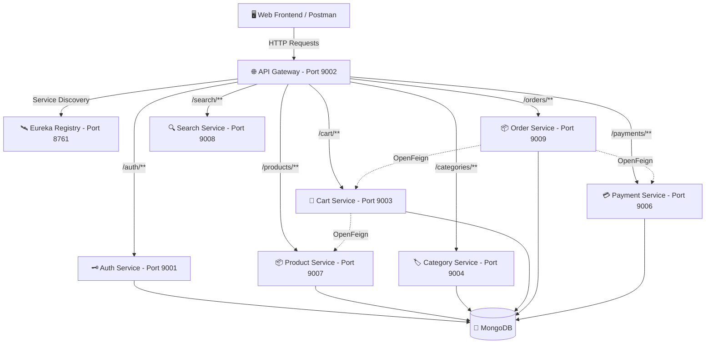

# ⚡ NexusCart - Enterprise E-Commerce Microservices Platform

NexusCart is a full-stack, enterprise-grade **E-Commerce Product Software Solution** engineered with a distributed **Spring Boot 3 & Spring Cloud Microservices Architecture** on the backend and a modern **Glassmorphic Single-Page Application (SPA)** on the frontend.

---

## 🌟 Software Architecture Overview



---

## 🚀 Key Software Features

### 🛒 Customer-Facing Features
- **Global Catalog Search**: Real-time product search with keyword debouncing across name & description.
- **Category Filtering**: Dynamic category pills navigation and product filtering.
- **Interactive Shopping Cart**: Real-time cart synchronization, quantity adjustments, and item deletion.
- **Instant Checkout & Payment**: Integrated order placement with instant payment processing validation.
- **Order History Tracking**: Track past orders and execution status (`PENDING`, `SUCCESS`, `COMPLETED`).
- **Dark Glassmorphic UI**: Ultra-modern responsive interface with Google Fonts (`Inter` & `Outfit`), CSS variables, micro-animations, and toast alerts.

### 🛡️ Admin & Backend Architecture Features
- **Microservices Modular Architecture**: 9 independent Spring Boot microservice modules.
- **Service Discovery**: Automated instance registration and load balancing via Netflix Eureka.
- **API Gateway Routing**: Single entry point (`http://localhost:9002`) with CORS headers and predicate routing.
- **Inter-Service Communication**: Declarative REST client calls using Spring Cloud OpenFeign.
- **Admin Management Panel**: Direct web interface for seeding products and categories into backend databases.
- **Offline Fallback Mode**: Frontend includes interactive demo fallback when backend services are offline.

---

## 🛠️ Complete Technology Stack

| Layer | Technologies & Tools |
| :--- | :--- |
| **Backend Framework** | Java 21, Spring Boot 3.2.5, Spring Cloud 2023.0.1 |
| **Microservice Cloud** | Spring Cloud Gateway, Netflix Eureka Discovery Server, OpenFeign Clients |
| **Database** | MongoDB (NoSQL) running on `localhost:27017` |
| **Frontend UI** | HTML5, Vanilla CSS3 (Glassmorphism & CSS Variables), ES6+ JavaScript |
| **Build & Tooling** | Apache Maven 3.x, Postman, Git |

---

## 🛰️ Microservices Port Mapping & Gateway Routes

All incoming HTTP requests pass through the **Spring Cloud API Gateway** on port `9002`.

| Service Name | Internal Port | Gateway Route Prefix | Primary Gateway Endpoint |
| :--- | :---: | :--- | :--- |
| **Eureka Server** | `8761` | N/A | `http://localhost:8761` |
| **API Gateway** | `9002` | `/*` | `http://localhost:9002` |
| **Auth Service** | `9001` | `/auth/**` | `http://localhost:9002/auth` |
| **Cart Service** | `9003` | `/cart/**` | `http://localhost:9002/cart` |
| **Category Service** | `9004` | `/categories/**` | `http://localhost:9002/categories` |
| **Payment Service** | `9006` | `/payments/**` | `http://localhost:9002/payments` |
| **Product Service** | `9007` | `/products/**` | `http://localhost:9002/products` |
| **Search Service** | `9008` | `/search/**` | `http://localhost:9002/search` |
| **Order Service** | `9009` | `/orders/**` | `http://localhost:9002/orders` |

---

## 🖥️ Running the Frontend Application

The frontend is located in the [`frontend/`](file:///Users/joysonpinto/Downloads/Ecommer-Spring-boot-backend-main/frontend/) directory.

### Quick Start (macOS / Linux):
```bash
open frontend/index.html
```

### Or using a local HTTP Server:
```bash
cd frontend
python3 -m http.server 3000
```
Then visit **`http://localhost:3000`** in your browser.

---

## 📑 Complete API Reference & Postman Test Guide

Ensure headers include `Content-Type: application/json` for all `POST` / `PUT` requests.

---

### 1. 🗝️ Auth Service (`/auth`)

#### 1.1 Sign Up User
- **Method**: `POST`
- **URL**: `http://localhost:9002/auth/signup`
- **Request Body (JSON)**:
```json
{
  "name": "John Doe",
  "email": "johndoe@example.com",
  "password": "securePassword123",
  "role": "CUSTOMER"
}
```

#### 1.2 Log In User
- **Method**: `POST`
- **URL**: `http://localhost:9002/auth/login`
- **Request Body (JSON)**:
```json
{
  "email": "johndoe@example.com",
  "password": "securePassword123"
}
```

---

### 2. 🏷️ Category Service (`/categories`)

#### 2.1 Create Category
- **Method**: `POST`
- **URL**: `http://localhost:9002/categories`
- **Request Body (JSON)**:
```json
{
  "name": "Electronics",
  "description": "Smartphones, audio gear, and accessories"
}
```

#### 2.2 Get All Categories
- **Method**: `GET`
- **URL**: `http://localhost:9002/categories`

#### 2.3 Get Category By ID
- **Method**: `GET`
- **URL**: `http://localhost:9002/categories/{id}`

---

### 3. 📦 Product Service (`/products`)

#### 3.1 Create Product
- **Method**: `POST`
- **URL**: `http://localhost:9002/products`
- **Request Body (JSON)**:
```json
{
  "name": "Wireless Noise Cancelling Headphones",
  "description": "Over-ear Bluetooth headphones with active noise cancellation",
  "price": 299.99,
  "categoryId": "669d0123abc456789def001",
  "stock": 50,
  "imageUrl": "https://images.unsplash.com/photo-1505740420928-5e560c06d30e"
}
```

#### 3.2 Get All Products
- **Method**: `GET`
- **URL**: `http://localhost:9002/products`

#### 3.3 Get Product By ID
- **Method**: `GET`
- **URL**: `http://localhost:9002/products/{id}`

#### 3.4 Get Products By Category
- **Method**: `GET`
- **URL**: `http://localhost:9002/products/category/{categoryId}`

#### 3.5 Search Products
- **Method**: `GET`
- **URL**: `http://localhost:9002/products/search?keyword=Headphones`

---

### 4. 🛒 Cart Service (`/cart`)

#### 4.1 Add Item to Cart
- **Method**: `POST`
- **URL**: `http://localhost:9002/cart/add`
- **Request Body (JSON)**:
```json
{
  "userId": "user_12345",
  "productId": "669d0456abc456789def002",
  "quantity": 2,
  "imageUrl": "https://images.unsplash.com/photo-1505740420928-5e560c06d30e"
}
```

#### 4.2 Get User Cart Details
- **Method**: `GET`
- **URL**: `http://localhost:9002/cart/user_12345`

#### 4.3 Remove Item From Cart
- **Method**: `DELETE`
- **URL**: `http://localhost:9002/cart/{cartItemId}`

---

### 5. 📦 Order Service (`/orders`)

#### 5.1 Place Order
- **Method**: `POST`
- **URL**: `http://localhost:9002/orders/place`
- **Request Body (JSON)**:
```json
{
  "userId": "user_12345",
  "productId": "669d0456abc456789def002",
  "quantity": 2,
  "totalPrice": 599.98,
  "status": "PENDING"
}
```

#### 5.2 Get User Orders
- **Method**: `GET`
- **URL**: `http://localhost:9002/orders/user_12345`

---

### 6. 💳 Payment Service (`/payments`)

#### 6.1 Process Payment
- **Method**: `POST`
- **URL**: `http://localhost:9002/payments`
- **Request Body (JSON)**:
```json
{
  "orderId": "order_998877",
  "amount": 599.98,
  "status": "SUCCESS"
}
```

---

### 7. 🔍 Search Service (`/search`)

#### 7.1 Global Keyword Search
- **Method**: `GET`
- **URL**: `http://localhost:9002/search/Headphones`

---

---

## 🚀 Advanced Enterprise Architecture Topics

For detailed code snippets, production configurations, and deployment manifests, see **[`ADVANCED.md`](file:///Users/joysonpinto/Downloads/Ecommer-Spring-boot-backend-main/ADVANCED.md)**.

### Included Advanced Topics:
1. 📡 **[Event-Driven Architecture (Apache Kafka)](file:///Users/joysonpinto/Downloads/Ecommer-Spring-boot-backend-main/ADVANCED.md#1-event-driven-architecture-apache-kafka)** - Producer/Consumer setups for async order processing.
2. ⚡ **[Distributed Caching Layer (Redis)](file:///Users/joysonpinto/Downloads/Ecommer-Spring-boot-backend-main/ADVANCED.md#2-distributed-caching-layer-redis)** - `@Cacheable` catalog query optimization.
3. 🛡️ **[Resilience & Circuit Breakers (Resilience4j)](file:///Users/joysonpinto/Downloads/Ecommer-Spring-boot-backend-main/ADVANCED.md#3-resilience--circuit-breakers-resilience4j)** - Gateway fallback routes and failure thresholds.
4. 🔐 **[Distributed Security (Spring Security + JWT)](file:///Users/joysonpinto/Downloads/Ecommer-Spring-boot-backend-main/ADVANCED.md#4-distributed-security-spring-security--jwt)** - Token verification filters & RBAC.
5. 📊 **[Distributed Tracing & Telemetry (Zipkin & Prometheus)](file:///Users/joysonpinto/Downloads/Ecommer-Spring-boot-backend-main/ADVANCED.md#5-distributed-tracing--telemetry-zipkin--prometheus)** - Cross-service correlation IDs (`traceId`).
6. 🐳 **[Containerization (Docker & Docker Compose)](file:///Users/joysonpinto/Downloads/Ecommer-Spring-boot-backend-main/ADVANCED.md#6-containerization-docker--docker-compose)** - Multi-container `docker-compose.yml` for all 9 microservices.
7. ☸️ **[Kubernetes (K8s) Auto-Scaling (HPA)](file:///Users/joysonpinto/Downloads/Ecommer-Spring-boot-backend-main/ADVANCED.md#7-kubernetes-k8s-deployment--auto-scaling)** - Kubernetes Deployments & Horizontal Pod Autoscaler YAML manifests.