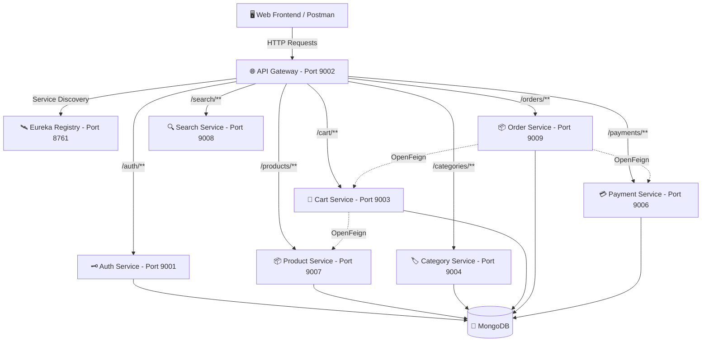

# ⚡ NexusCart - Enterprise E-Commerce Microservices Platform

NexusCart is a full-stack, enterprise-grade **E-Commerce Product Software Solution** engineered with a distributed **Spring Boot 3 & Spring Cloud Microservices Architecture** on the backend and a modern **Glassmorphic Single-Page Application (SPA)** on the frontend.

---

## 🌟 Software Architecture Overview



---

## 🚀 Key Software Features

### 🛒 Customer-Facing Features
- **Global Catalog Search**: Real-time product search with keyword debouncing across name & description.
- **Category Filtering**: Dynamic category pills navigation and product filtering.
- **Interactive Shopping Cart**: Real-time cart synchronization, quantity adjustments, and item deletion.
- **Instant Checkout & Payment**: Integrated order placement with instant payment processing validation.
- **Order History Tracking**: Track past orders and execution status (`PENDING`, `SUCCESS`, `COMPLETED`).
- **Dark Glassmorphic UI**: Ultra-modern responsive interface with Google Fonts (`Inter` & `Outfit`), CSS variables, micro-animations, and toast alerts.

### 🛡️ Admin & Backend Architecture Features
- **Microservices Modular Architecture**: 9 independent Spring Boot microservice modules.
- **Service Discovery**: Automated instance registration and load balancing via Netflix Eureka.
- **API Gateway Routing**: Single entry point (`http://localhost:9002`) with CORS headers and predicate routing.
- **Inter-Service Communication**: Declarative REST client calls using Spring Cloud OpenFeign.
- **Admin Management Panel**: Direct web interface for seeding products and categories into backend databases.
- **Offline Fallback Mode**: Frontend includes interactive demo fallback when backend services are offline.

---

## 🛠️ Complete Technology Stack

| Layer | Technologies & Tools |
| :--- | :--- |
| **Backend Framework** | Java 21, Spring Boot 3.2.5, Spring Cloud 2023.0.1 |
| **Microservice Cloud** | Spring Cloud Gateway, Netflix Eureka Discovery Server, OpenFeign Clients |
| **Database** | MongoDB (NoSQL) running on `localhost:27017` |
| **Frontend UI** | HTML5, Vanilla CSS3 (Glassmorphism & CSS Variables), ES6+ JavaScript |
| **Build & Tooling** | Apache Maven 3.x, Postman, Git |

---

## 🛰️ Microservices Port Mapping & Gateway Routes

All incoming HTTP requests pass through the **Spring Cloud API Gateway** on port `9002`.

| Service Name | Internal Port | Gateway Route Prefix | Primary Gateway Endpoint |
| :--- | :---: | :--- | :--- |
| **Eureka Server** | `8761` | N/A | `http://localhost:8761` |
| **API Gateway** | `9002` | `/*` | `http://localhost:9002` |
| **Auth Service** | `9001` | `/auth/**` | `http://localhost:9002/auth` |
| **Cart Service** | `9003` | `/cart/**` | `http://localhost:9002/cart` |
| **Category Service** | `9004` | `/categories/**` | `http://localhost:9002/categories` |
| **Notification Service** | `9005` | N/A (Kafka Event Consumer) | `http://localhost:9005` |
| **Payment Service** | `9006` | `/payments/**` | `http://localhost:9002/payments` |
| **Product Service** | `9007` | `/products/**` | `http://localhost:9002/products` |
| **Search Service** | `9008` | `/search/**` | `http://localhost:9002/search` |
| **Order Service** | `9009` | `/orders/**` | `http://localhost:9002/orders` |

---

## 🚦 Recommended Microservice Launch Sequence

To ensure smooth service registration and inter-service communication, start the services in the following order:

1. 🛰️ **Infrastructure Base**:
   - `Eureka1` (Port 8761) — *Service Discovery Registry*
   - `Kafka` (Port 9092) & `MongoDB` (Port 27017)
2. 🌐 **API Gateway**:
   - `API-GATEWAY` (Port 9002) — *Edge Routing*
3. 🔑 **Core Domain Services**:
   - `AUTH-SERVICE` (Port 9001)
   - `Category` (Port 9004)
   - `product` (Port 9007)
4. 🛒 **Transactional Services**:
   - `Cart` (Port 9003)
   - `ORDER` (Port 9009)
   - `PAYMENT-SERVICE` (Port 9006)
5. 🔍 **Utility & Messaging Services**:
   - `SearchService` (Port 9008)
   - `Notification` (Port 9005)

---

## 🖥️ Running the Frontend Application

The frontend is located in the [`frontend/`](file:///Users/joysonpinto/Downloads/Ecommer-Spring-boot-backend-main/frontend/) directory.

### Quick Start (macOS / Linux):
```bash
open frontend/index.html
```

### Or using a local HTTP Server:
```bash
cd frontend
python3 -m http.server 3000
```
Then visit **`http://localhost:3000`** in your browser.

---

## 📑 Complete API Reference & Postman Test Guide

Ensure headers include `Content-Type: application/json` for all `POST` / `PUT` requests.

---

## 🚀 Advanced Enterprise Architecture Topics

For detailed code snippets, production configurations, and deployment manifests, see **[`ADVANCED.md`](file:///Users/joysonpinto/Downloads/Ecommer-Spring-boot-backend-main/ADVANCED.md)**.

### Included Advanced Topics:
1. 📡 **[Event-Driven Architecture (Apache Kafka)](file:///Users/joysonpinto/Downloads/Ecommer-Spring-boot-backend-main/ADVANCED.md#1-event-driven-architecture-apache-kafka)** - Producer/Consumer setups for async order processing.
2. ⚡ **[Distributed Caching Layer (Redis)](file:///Users/joysonpinto/Downloads/Ecommer-Spring-boot-backend-main/ADVANCED.md#2-distributed-caching-layer-redis)** - `@Cacheable` catalog query optimization.
3. 🛡️ **[Resilience & Circuit Breakers (Resilience4j)](file:///Users/joysonpinto/Downloads/Ecommer-Spring-boot-backend-main/ADVANCED.md#3-resilience--circuit-breakers-resilience4j)** - Gateway fallback routes and failure thresholds.
4. 🔐 **[Distributed Security (Spring Security + JWT)](file:///Users/joysonpinto/Downloads/Ecommer-Spring-boot-backend-main/ADVANCED.md#4-distributed-security-spring-security--jwt)** - Token verification filters & RBAC.
5. 📊 **[Distributed Tracing & Telemetry (Zipkin & Prometheus)](file:///Users/joysonpinto/Downloads/Ecommer-Spring-boot-backend-main/ADVANCED.md#5-distributed-tracing--telemetry-zipkin--prometheus)** - Cross-service correlation IDs (`traceId`).
6. 🐳 **[Containerization (Docker & Docker Compose)](file:///Users/joysonpinto/Downloads/Ecommer-Spring-boot-backend-main/ADVANCED.md#6-containerization-docker--docker-compose)** - Multi-container `docker-compose.yml` for all 9 microservices.
7. ☸️ **[Kubernetes (K8s) Auto-Scaling (HPA)](file:///Users/joysonpinto/Downloads/Ecommer-Spring-boot-backend-main/ADVANCED.md#7-kubernetes-k8s-deployment--auto-scaling)** - Kubernetes Deployments & Horizontal Pod Autoscaler YAML manifests.